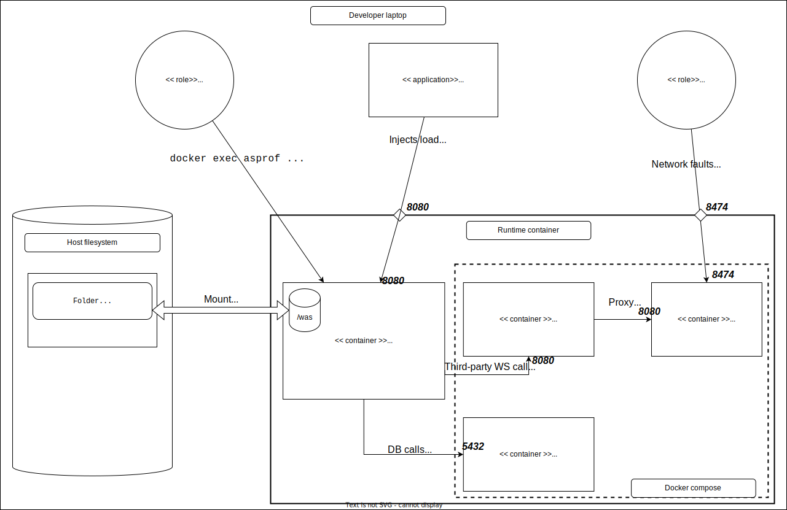

# Async profiler on an Insee workstation (Windows with Podman)

## Getting started

Here is a first pass to get familiar with the application environment and k6.

**Architecture of your workspace:**



### Before anything else

#### Clone the repository we will use

````shell
git clone --branch=insee https://github.com/FBibonne/was.git
````

Note the path of the directory where you cloned the repository: it will be referred to as `/path/to/repo/was` from now on.

#### Start Podman

If not already done, for the rest of the workshop: in a terminal:

````shell
podman machine start
````

### Start the application

#### 1. First, the application dependencies

In a terminal, run:

```sh
podman compose up -d
```

Leave this terminal window open until the end of the workshop.

#### 2. Then the Java application:

In a new terminal, **in the `/path/to/repo/was` folder**, run:

```sh
set WAS_CONTAINER_CONFIG=--rm --init -i -v .:/was -p 8080:8080
set WAS_NETWORK_CONFIG=--add-host host.docker.internal:host-gateway
set WAS_ENV_CONFIG=--env WORKSHOP_ASYNCPROFILER_DEPENDENCIES_HOSTNAME=host.docker.internal
set WAS_IMAGE="gitlab-registry.insee.fr/kubernetes/images/run/java:25.0.3_9-jre-rootless"
set WAS_LAUNCH=java -Xmx250m -Xms250m -XX:+UnlockDiagnosticVMOptions -XX:+DebugNonSafepoints -XX:TieredStopAtLevel=1 -XX:FlightRecorderOptions:stackdepth=512 -jar /was/workshop-async-profiler.jar
podman run --name=was-java-app %WAS_CONTAINER_CONFIG% %WAS_NETWORK_CONFIG% %WAS_ENV_CONFIG% %WAS_IMAGE% %WAS_LAUNCH%      
```

The application starts on port 8080 of the container, which is mapped to port 8080 on the host.
Let's verify it is working correctly (in a new terminal 😉):

```sh
curl http://localhost:8080/books
```

- Let's verify the mock third-party WS proxy via wiremock is working:

```sh
curl http://localhost:8100/new-books
```

- If the mock proxy does not respond, you can try running `podman compose up -d` again.
- Let's verify another application endpoint:

```sh
curl http://localhost:8080/new-books
```

---
**NOTE**

Let's examine the actual Java command used to start the application (`%WAS_LAUNCH%`) and its options:

- `-Xmx250m`, `-Xms250m` sets the maximum (and initial) JVM heap size to 250 MB: setting Xmx and Xms to the same value is a good practice to optimize JVM memory.
- `-XX:FlightRecorderOptions:stackdepth=512`: for JDK Flight Recorder users — determines the maximum size of collected stacks.
- `-XX:+UnlockDiagnosticVMOptions`: unlocks the following options (unsupported HotSpot JVM options: https://www.baeldung.com/jvm-tuning-flags)
- `-XX:+DebugNonSafepoints`: to get unbiased profiling information [when async-profiler is not loaded at JVM startup as an agent](https://github.com/async-profiler/async-profiler/blob/master/docs/Troubleshooting.md#known-limitations) (otherwise profiling data is only collected at _safepoints_, which are specific thread states and therefore introduce a bias in profiling).
- `-XX:TieredStopAtLevel=1` Sets the intermediate compilation level to 1 (lowest level) to prevent the JVM from spending too much time on runtime optimizations.

In general, see here for all options of a given JVM: https://chriswhocodes.com/hotspot_options_openjdk25.html

---

### Inject load

Once the application has started correctly, inject load with k6: in a (new 😉) terminal, in the `/path/to/repo/was` folder:

```sh
k6 run k6/warmup.js
```

The warmup script will:
- Launch 10 virtual users (VUs)
- Each VU will run 20 iterations
- Call the `/books` and `/new-books` endpoints
- Verify that 99% of requests execute in less than 1000 ms
- Maximum execution duration is capped at 30 seconds

> [!important]
> ❓ Look at the content of the warmup.js file and analyze the results.

## Profiling

### Get async-profiler

- Extract the archive downloaded from [https://github.com/async-profiler/async-profiler/releases/latest](https://github.com/async-profiler/async-profiler/releases/latest) (linux-x64)
at the root of `/path/to/repo/was`.

### 🔥 Flamegraph

[Learn more about Flamegraphs](https://github.com/FBibonne/was/tree/insee#profiling)

### Find and note the PID of the was Java application inside its container

To run async-profiler, we will need the PID (Process ID) of the Java application. Here is how to find it (in a new terminal):

```sh
podman top was-java-app
```

Note it down or store it in the `WORKSHOP_PID` environment variable (that is how we will refer to it from now on).


### Wall-clock profiling

Wall-clock time (also called wall time) is the actual elapsed time to execute a block of code.
Most applications interact with third-party components such as a database, HTTP or gRPC resources, or a message broker (RabbitMQ, Apache Kafka, etc.).
In these cases, the application spends most of its time waiting for I/O, waiting for these external components to respond.

#### Send load

During profiling, to get meaningful results, the application must be under load: run the k6 script in a terminal:

```sh
k6 run k6/main.js
```

#### First Flamegraph with async-profiler

As soon as the k6 script is running, start profiling (in the terminal where `%WORKSHOP_PID%` was defined):

````shell
podman exec -i was-java-app /was/async-profiler-4.4-linux-x64/bin/asprof -e wall -f /was/wall.html %WORKSHOP_PID%
````

Profiling will last 60 s.

The `-e wall` option tells async-profiler to sample all threads with equal probability regardless of their state
(Running, Sleeping or Blocked) over a given time period => [README](https://github.com/async-profiler/async-profiler/blob/master/docs/ProfilingModes.md#wall-clock-profiling)

[This page](https://github.com/async-profiler/async-profiler/blob/master/docs/ProfilerOptions.md) documents the async-profiler options.

The resulting flamegraph is an HTML file created in the shared volume between the workstation and the container:
you can find it in Windows Explorer at the root of `/path/to/repo/was` and open it with a browser.

> [!important]
> ❓ Questions:
> - How many HTTP requests were made?
> - What is the average duration and the p9X?
> - What does the application do?
> - Where do the books from the `books` endpoint come from?
> - Where do the books from the `new-books` endpoint come from?
> - What takes the most time?

#### How does it look thread by thread?

Repeat the profiling (don't forget to trigger the k6 script) with the `-t` option.

````shell
podman exec -i was-java-app /was/async-profiler-4.4-linux-x64/bin/asprof -e wall -t -f /was/wall-per-thread.html %WORKSHOP_PID%
````

> [!important]
> ❓ Count the number of Tomcat threads.

#### And with latency

Let's inject 100 ms of latency via toxiproxy on the third-party WS called by our application (run in **git bash**):

```sh
curl --noproxy localhost -i -XPOST -d '{"type" : "latency", "attributes" : {"latency" : 100}}' http://localhost:8474/proxies/wiremock/toxics
```

Repeat the profiling (don't forget to trigger the k6 script), still with the `-t` option:

````shell
podman exec -i was-java-app /was/async-profiler-4.4-linux-x64/bin/asprof -e wall -t -f /was/wall-latency.html %WORKSHOP_PID%
````

**To search for methods in the flamegraph, you can use the CTRL+F shortcut or the magnifying glass 🔎.**

> [!important]
> ❓ In the flamegraph, look for the `/books` and `/new-books` endpoints of the application.
> What is the main difference compared to the first flamegraph? Can you explain these differences?

Once your analysis is done, remove the latency with:

```sh
curl --noproxy localhost -i -XDELETE http://localhost:8474/proxies/wiremock/toxics/latency_downstream
```

### Memory profiling

Add an `authors` function to the `k6/main.js` file. It should call the `/authors` endpoint.

```js
export function authors() {
    let res = http.get(`${BASE_URL}/authors`, { tags: { books: "authors" } });
    // Validate response status
    check(res, { "status was 200": (r) => r.status == 200 }, { books: "authors" });
}
```

Add the k6 scenario configuration:

```js
// add inside the thresholds structure
"http_req_duration{books: \"authors\"}": ["p(99) < 1000"]
```

and

```js
// add inside the scenarios structure
authors: {
   executor: 'per-vu-iterations',
   exec: 'authors',
   vus: 200,
   iterations: 500,
   maxDuration: '5m',
}
```

Let's use async-profiler to profile memory usage (always after starting the k6 script):

```sh
podman exec -i was-java-app /was/async-profiler-4.4-linux-x64/bin/asprof -e alloc -f /was/memory.html %WORKSHOP_PID%
```

The `memory.html` flamegraph contains a sampling of memory allocations (option `-e alloc`).

> [!important]
> ❓ Can you identify what consumes the most memory? Why?

<details>
<summary><b>Solution</b></summary>

- It is a custom implementation of a Spring filter that seems to just log HTTP requests but consumes a lot of memory.
- => You should use the filter provided by Spring (CommonsRequestLoggingFilter).
- Find where the filter is declared so you can replace it with the Spring implementation: let's try without looking at the code!
</details>

#### Start profiling at the same time as the application

For now, we cannot identify which piece of code created the logging filter. We can assume it is a Spring bean created at application startup.
We need to profile code from JVM startup: **let's use async-profiler as a Java agent**.

> If you need to profile code from JVM startup, rather than using asprof, you can attach async-profiler as an agent on the command line.
> [README](https://github.com/async-profiler/async-profiler/blob/master/docs/IntegratingAsyncProfiler.md)

Stop the Java application and restart it with this new parameter: `-agentpath:/was/async-profiler-4.4-linux-x64/lib/libasyncProfiler.so=start,event="workshop.asyncprofiler.HandMadeRequestLoggingFilter.<init>"`

```sh
set WAS_LAUNCH=java -agentpath:/was/async-profiler-4.4-linux-x64/lib/libasyncProfiler.so=start,event="workshop.asyncprofiler.HandMadeRequestLoggingFilter.<init>" -Xmx250m -Xms250m -XX:+UnlockDiagnosticVMOptions -XX:+DebugNonSafepoints -XX:TieredStopAtLevel=1 -XX:FlightRecorderOptions:stackdepth=512 -jar /was/workshop-async-profiler.jar
podman run --name=was-java-app %WAS_CONTAINER_CONFIG% %WAS_NETWORK_CONFIG% %WAS_ENV_CONFIG% %WAS_IMAGE% %WAS_LAUNCH%
```

Once the application has started, wait about fifteen seconds then run:

```sh
podman exec -i was-java-app /was/async-profiler-4.4-linux-x64/bin/asprof dump %WORKSHOP_PID%
```

Look at the output in the terminal: can you tell where the `HandMadeRequestLoggingFilter` instance comes from?

<details>
   <summary><b>Solution</b></summary>

The memory allocation is due to the `HandMadeRequestLoggingFilter` bean created in the bean method `WorkshopAsyncProfilerApplication#requestLoggingFilter`.

The HandMadeRequestLoggingFilter implementation is not very efficient: it creates a 5 MB array on every HTTP request.
Thanks to profiling, we have found where to replace it with the implementation provided by Spring (`CommonsRequestLoggingFilter`),
which no longer has this excessive memory allocation problem.

</details>


<details>
<summary>Going further: another example of profiling use</summary>

The original implementation of the `ContentCachingRequestWrapper` object used by the Spring filter to log requests
had a very similar implementation to the one used in the workshop, with the same defect of performing too many unnecessary memory allocations.
Tracing back the discussion at the origin of the fix that benefits the current version,
we find a use of profiling to diagnose the problem:
https://github.com/spring-projects/spring-framework/pull/29775#issuecomment-1813576150 !
</details>


### CPU profiling

> [!tip]
> Don't forget to restart the application without the async-profiler Java agent.

```sh
# stop the application: CTRL+C
set WAS_LAUNCH=java -Xmx250m -Xms250m -XX:+UnlockDiagnosticVMOptions -XX:+DebugNonSafepoints -XX:TieredStopAtLevel=1 -XX:FlightRecorderOptions:stackdepth=512 -jar /was/workshop-async-profiler.jar
podman run --name=was-java-app %WAS_CONTAINER_CONFIG% %WAS_NETWORK_CONFIG% %WAS_ENV_CONFIG% %WAS_IMAGE% %WAS_LAUNCH%
```

A new endpoint has been developed and deployed. It computes an author's score based on all their books.

Some say it is a heavy CPU consumer — let's verify.

Add an `authorRating` function to the `k6/main.js` file. It should call the `/authors` endpoint:

````js
export function authorRating() {
    let authors= ["Madeline Miller","Erin Morgenstern","Tara Westover","Michelle Obama"]
    const randomIndex = Math.floor(Math.random() * authors.length);

    let res = http.get(`${BASE_URL}/author/${authors[randomIndex]}/rating`, { tags: { books: "author-rating" } });
    // Validate response status
    check(res, { "status was 200": (r) => r.status == 200 }, { books: "author-rating" });
}
````

Add the k6 scenario configuration:

```js
// add inside the scenarios structure
authorratings: {
    executor: 'per-vu-iterations',
        exec: 'authorRating',
        vus: 200,
        iterations: 500,
        maxDuration: '5m',
}
```

Let's use async-profiler to profile CPU usage (always after starting the k6 script):

```sh
podman exec -i was-java-app /was/async-profiler-4.4-linux-x64/bin/asprof -e  cpu -f /was/cpu.html %WORKSHOP_PID%
```

You may encounter errors when profiling the CPU event:

  ```sh
  [WARN] Kernel symbols are unavailable due to restrictions. Try
    sysctl kernel.perf_event_paranoid=1
    sysctl kernel.kptr_restrict=0
  [WARN] perf_event_open for TID 49766 failed: Permission denied
  ```
If changing the configuration is not possible, you can use the `itimer` profiling mode instead:

```sh
podman exec -i was-java-app /was/async-profiler-4.4-linux-x64/bin/asprof -e  itimer -f /was/cpu.html %WORKSHOP_PID%
```

> [!important]
> ❓ Generate all flamegraphs and analyze the results.

## Resources

Here are some resources on the concepts and tools used in this workshop:

- [async-profiler](https://github.com/async-profiler/async-profiler)
- [jvmperf](https://jvmperf.net/)
- [Coloring Flame Graphs: Code Hues](https://www.brendangregg.com/blog/2017-07-30/coloring-flamegraphs-code-type.html) by Brendan Gregg
- [A Guide to async-profiler](https://www.baeldung.com/java-async-profiler) by Anshul Bansal and Eric Martin
- [USENIX ATC '17: Visualizing Performance with Flame Graphs](https://www.youtube.com/watch?v=D53T1Ejig1Q) by Brendan Gregg
- [Taming performance issues into the wild: a practical guide to JVM profiling](https://www.youtube.com/watch?v=Cw4nN5L-2vU) by Francesco Nigro, Mario Fusco
- [[Java][Profiling] Async-profiler - manual by use cases](https://krzysztofslusarski.github.io/2022/12/12/async-manual.html) by Krzysztof Ślusarski
- [[Java][Profiling][Memory leak] Finding heap memory leaks with Async-profiler](https://krzysztofslusarski.github.io/2022/11/27/async-live.html) by Krzysztof Ślusarski
- [Java Safepoint and Async Profiling](https://seethawenner.medium.com/java-safepoint-and-async-profiling-cdce0818cd29) by Seetha Wenner
- 🇫🇷 [Traquer une fuite mémoire :cas d'étude avec Hibernate 5, ne tombez pas dans le IN !](https://www.sfeir.dev/back/traquer-une-fuite-memoire-cas-detude-avec-hibernate-5-ne-tombez-pas-dans-le-in/)by Ling-Chun SO
- 🇫🇷 [Sous le capot d'une application JVM - Java Flight Recorder / Java Mission Control](https://www.youtube.com/watch?v=wa_EtTUx-z0) by Guillaume Darmont
- 🇫🇷 [Performance et diagnostic - Méthodologie et outils](https://speakerdeck.com/vladislavpernin/performance-et-diagnostic-methodologie-et-outils) by Vladislav Pernin
- [CPU profiling errors: possible alternatives](https://github.com/async-profiler/async-profiler/blob/master/docs/Troubleshooting.md#perf-events-unavailable)
- [Clarify samples count between -e cpu and -e itimer](https://github.com/async-profiler/async-profiler/issues/272)