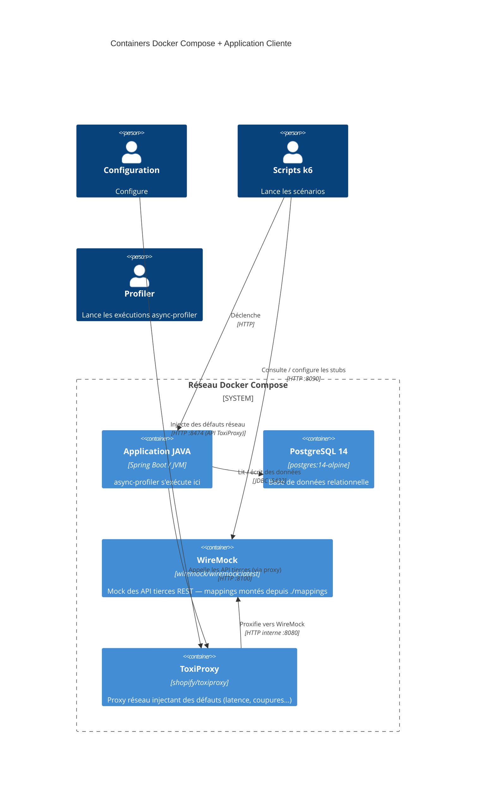

```mermaid
C4Container
    title Containers Docker Compose + Application Cliente

    Person(confProxy, "Configuration", "Configure ")
    Person(k6, "Scripts k6", "Lance les scénarios")
    Person(profiler, "Profiler", "Lance les exécutions async-profiler")

    System_Boundary(docker, "Réseau Docker Compose") {
        Container(app, "Application JAVA", "Spring Boot / JVM", "async-profiler s'exécute ici")
        Container(postgres, "PostgreSQL 14", "postgres:14-alpine", "Base de données relationnelle")
        Container(wiremock, "WireMock", "wiremock/wiremock:latest", "Mock des API tierces REST — mappings montés depuis ./mappings")
        Container(toxiproxy, "ToxiProxy", "shopify/toxiproxy", "Proxy réseau injectant des défauts (latence, coupures…)")
    }

    Rel(k6, app, "Déclenche", "HTTP")
    
    Rel(k6, wiremock, "Consulte / configure les stubs", "HTTP :8090")

    Rel(confProxy, toxiproxy, "Injecte des défauts réseau", "HTTP :8474 (API ToxiProxy)")

    Rel(app, postgres, "Lit / écrit des données", "JDBC :5432")
    Rel(app, toxiproxy, "Appelle les API tierces (via proxy)", "HTTP :8100")

    Rel(toxiproxy, wiremock, "Proxifie vers WireMock", "HTTP interne :8080")
```
